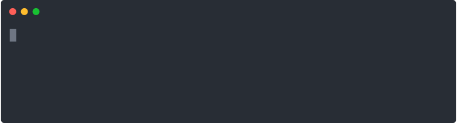

# tabtab

[](https://github.com/denosaurs/tabtab/releases)
[](https://github.com/denosaurs/tabtab/actions)
[](https://github.com/denosaurs/depsbot)
[](https://github.com/denosaurs/tabtab/blob/master/LICENSE)

<p align="center">
  <br>
  
  <br>
</p>

## Usage

Writing completion is a two-step process: Installation and Logging. Tabtab
provides just that.

Here is a basic example using
[std parse](https://deno.land/std@0.78.0/flags) to parse arguments.

```js
import { tabtab, ParsedEnv } from "../mod.ts";
import { parse } from "https://deno.land/std@0.78.0/flags/mod.ts";

const opts = parse(Deno.args, {
  string: ["foo", "bar"],
  boolean: ["help", "version", "loglevel"],
});

const args = opts._;
const completion = (env: ParsedEnv) => {
  if (!env.complete) return;

  // Write your completions there

  if (env.prev === "foo") {
    return tabtab.log(["is", "this", "the", "real", "life"]);
  }

  if (env.prev === "bar") {
    return tabtab.log(["is", "this", "just", "fantasy"]);
  }

  if (env.prev === "--loglevel") {
    return tabtab.log(["error", "warn", "info", "notice", "verbose"]);
  }

  return tabtab.log([
    "--help",
    "--version",
    "--loglevel",
    "foo",
    "bar",
    "someCommand:a comprehensive description of the command",
    {
      name: "someOtherCommand",
      description: "comprehensive description of the other command",
    },
    "anotherOne",
  ]);
};

const run = async () => {
  const cmd = args[0];

  // Write your CLI there

  // Here we install for the program `tabtab-test` (this file), with
  // completer being the same program. Sometimes, you want to complete
  // another program that's where the `completer` option might come handy.
  if (cmd === "install-completion") {
    await tabtab.install({
      name: "tabtab-test",
      completer: "tabtab-test",
      location: tabtab.defaultLocation(),
    });

    return;
  }

  if (cmd === "uninstall-completion") {
    // Here we uninstall for the program `tabtab-test` (this file).
    await tabtab.uninstall({
      name: "tabtab-test",
    });

    return;
  }

  // The completion command is added automatically by tabtab when the program
  // is completed. Can be configured with the `cmd` option in install.
  if (cmd === "completion") {
    const env = tabtab.parseEnv();
    return completion(env);
  }
};

run();
```

Please refer to the
[examples/hello.ts](examples/hello.ts) module for a
working example. The following usage documentation is based on it.

### 1. Install completion

To enable completion for a given program or module, you must enable the
completion on your or user's system. This is done by calling `tabtab.install()`
usually behind a `program install-completion` command or something similar.

```js
// Here we install for the program `tabtab-test`, with completer being the same
// program. Sometimes, you want to complete another program that's where the
// `completer` option might come handy.
tabtab
  .install({
    name: "tabtab-test",
    completer: "tabtab-test",
    location: "~/.profile", // optional
    cmd: "completions", // optional
  })
  .then(() => console.log("Completion installed"))
  .catch((err) => console.error(err));
```

The method returns a promise, so `await / async` usage is possible. It takes an
`options` parameter, with:

- `name`: The program to complete
- `completer`: The program that does the completion (can be the same program).
- `location`: Location of shell configuration.
- `cmd`: Command to call your script with when asking for completions.

`tabtab.install()` will ask the user which SHELL to use, and optionally a path
to write to. This will add a new line to either `~/.bashrc`, `~/.zshrc` or
`~/.config/fish/config.fish` file to source tabtab completion script.

Only one line will be added, even if it is called multiple times.

### 2. Log completion

Once the completion is enabled and active, you can write completions for the
program (here, in this example `tabtab-test`). Briefly, adding completions is
as simple as logging output to `stdout`, with a few particularities (namely on
Bash, and for descriptions), but this is taken care of by `tabtab.log()`.

```js
tabtab.log([
  '--help',
  '--version',
  'command'
  'command-two'
]);
```

This is the simplest way of adding completions. You can also use an object,
instead of a simple string, with `{ name, description }` property if you want
to add descriptions for each completion item, for the shells that support them
(like Zsh or Fish). Or use the simpler `name:description` form.

```js
tabtab.log([
  { name: "command", description: "Description for command" },
  "command-two:Description for command-two",
]);
```

The `{ name, description }` approach is preferable in case you have completion
items with `:` in them.

Note that you can call `tabtab.log()` multiple times if you prefer to do so, it
simply logs to the console in sequence.

### 3. Parsing env

If you ever want to add more intelligent completion, you'll need to check and
see what is the last or previous word in the completed line, so that you can
add options for a specific command or flag (such as loglevels for `--loglevel`
for instance).

Tabtab adds a few environment variables for you to inspect and use, this is
done by calling `tabtab.parseEnv()` method.

```js
const env = tabtab.parseEnv();
// env:
//
// - complete    A Boolean indicating whether we act in "plumbing mode" or not
// - words       The Number of words in the completed line
// - point       A Number indicating cursor position
// - line        The String input line
// - partial     The String part of line preceding cursor position
// - last        The last String word of the line
// - lastPartial The last word String of partial
// - prev        The String word preceding last
```

Usually, you'll want to check against `env.last` or `env.prev`.

```js
if (env.prev === "--loglevel") {
  tabtab.log(["error", "warn", "info", "notice", "verbose"]);
}
```

## Completion mechanism

Feel free to browse the [scripts](./scripts) directory to inspect the various
template files used when creating a completion with `tabtab.install()`.

Here is a Bash completion snippet created by tabtab.

```bash
###-begin-tabtab-test-completion-###
if type complete &>/dev/null; then
  _tabtab-test_completion () {
    local words cword
    if type _get_comp_words_by_ref &>/dev/null; then
      _get_comp_words_by_ref -n = -n @ -n : -w words -i cword
    else
      cword="$COMP_CWORD"
      words=("${COMP_WORDS[@]}")
    fi

    local si="$IFS"
    IFS=$'\n' COMPREPLY=($(COMP_CWORD="$cword" \
                           COMP_LINE="$COMP_LINE" \
                           COMP_POINT="$COMP_POINT" \
                           tabtab-test completion -- "${words[@]}" \
                           2>/dev/null)) || return $?
    IFS="$si"
    if type __ltrim_colon_completions &>/dev/null; then
      __ltrim_colon_completions "${words[cword]}"
    fi
  }
  complete -o default -F _tabtab-test_completion tabtab-test
fi
###-end-tabtab-test-completion-###
```

The system is quite simple (though hard to nail it down, thank you npm). A new
Bash function is created, which is invoked whenever `tabtab-test` is tab
completed. This function then invokes the completer `tabtab-test completion`
with `COMP_CWORD`, `COMP_LINE` and `COMP_POINT` environment variables (which is
parsed by `tabtab.parseEnv()`).

The same mechanism can be applied to Zsh and Fish.

### Completion install

As described in the [`Usage > Install Completion`](#1-install-completion)
section, installing a completion involves adding a new line to source in either
`~/.bashrc`, `~/.zshrc` or `~/.config/fish/config.fish` file.

In the `3.0.0` version, it has been improved to only add a single line instead
of multiple ones, one for each completion module installed on the system.

This way, a single line is added to enable the completion of for various
programs without cluttering the Shell configuration file.

Example for `~/.bashrc`

```bash
# deno tabtab source for modules
# uninstall by removing these lines
[ -f ~/.config/tabtab/__tabtab.bash ] && . ~/.config/tabtab/__tabtab.bash || true
```

It'll load a file `__tabtab.bash`, created in the `~/.config/tabtab` directory,
which will hold all the source lines for each tabtab modules defining a
completion.

```bash
# deno tabtab source for foo module
# uninstall by removing these lines
[ -f ~/.config/tabtab/foo.bash ] && . ~/.config/tabtab/foo.bash || true

# deno tabtab source for tabtab-test module
# uninstall by removing these lines
[ -f ~/.config/tabtab/tabtab-test.bash ] && . ~/.config/tabtab/tabtab-test.bash || true
```

### Completion uninstall

You can follow the file added in your SHELL configuration file and disable a
completion by removing the above lines.

Or simply disable tabtab by removing the line in your SHELL configuration file.

Or, you can use `tabtab.uninstall()` to do this for you.

```js
if (cmd === "uninstall-completion") {
  // Here we uninstall for the program `tabtab-test`
  await tabtab
    .uninstall({
      name: "tabtab-test",
    })
    .catch((err) => console.error("UNINSTALL ERROR", err));

  return;
}
```

## Debugging

tabtab internally logs a lot of things, using the
[debug](https://deno.land/x/debug) module.

When testing a completion, it can be useful to see those logs, but writing to
`stdout` or `stderr` while completing something can be troublesome.

## Maintainers

- Filippo Rossi ([@qu4k](https://github.com/qu4k))

## Permission Table

| Permission Needed | Required | Reason                                       |
| ----------------- | -------- | -------------------------------------------- |
| `--allow-env`     | yes      | Detecting current shell and completion vars. |

## Other

### Related

- [tabtab](https://github.com/mklabs/tabtab) - tab completion helpers, for node cli programs & others.

### Contribution

Pull request, issues and feedback are very welcome. Code style is formatted with `deno fmt` and commit messages are done following Conventional Commits spec.

### Licence

Copyright 2020-present, the denosaurs team. All rights reserved. MIT license.
